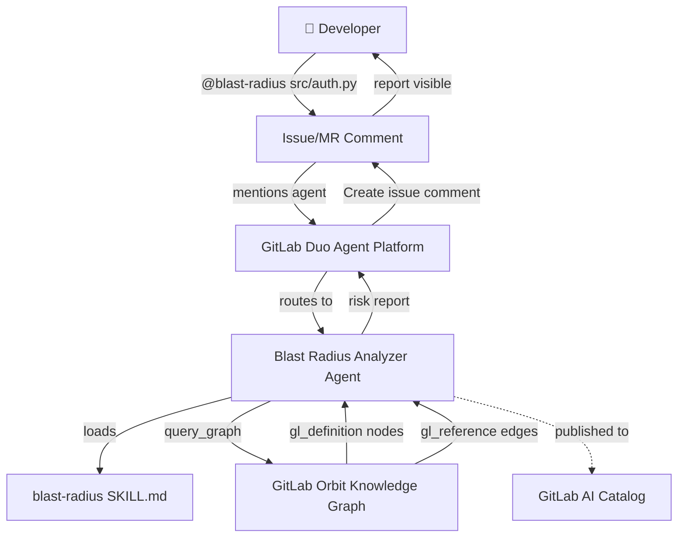
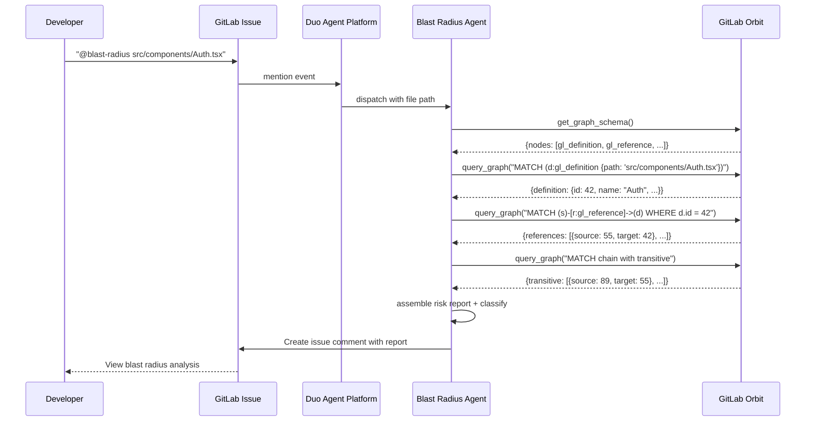

# Architecture

## System Overview

```
Developer mentions @blast-radius in issue comment
  ↓
GitLab Duo Agent Platform routes mention to agent
  ↓
Agent receives file path + project context from AGENTS.md + skill
  ↓
Agent calls Orbit MCP: get_graph_schema → query_graph
  ↓
Orbit traverses knowledge graph (definitions → references → transitive)
  ↓
Agent assembles dependency chain + risk classification
  ↓
Agent posts risk report as issue comment via Create Issue Comment tool
```

## Component Architecture



## Data Flow



## Knowledge Graph Schema

Orbit represents code as a graph:

### Node Types

| Label | Description |
|---|---|
| `gl_definition` | A code definition: file, function, class, module, interface |
| `gl_documentation` | Documentation associated with a definition |

### Edge Types

| Label | Description |
|---|---|
| `gl_reference` | Source file references/depends on target file |
| `gl_documents` | Documentation relationship |

### gl_definition Properties

| Property | Type | Description |
|---|---|---|
| `id` | int | Unique identifier |
| `name` | string | Human-readable name (function/class name) |
| `path` | string | File path within the repository |
| `language` | string | Programming language (python, typescript, etc.) |
| `project_path` | string | GitLab project path |

### gl_reference Properties

| Property | Type | Description |
|---|---|---|
| `source_id` | int | The file doing the importing/referencing |
| `target_id` | int | The file being imported/referenced |
| `relationship_type` | string | import, call, extend, implement |

## Blast Radius Traversal Algorithm

```
function blast_radius(target_path, max_depth=3):
    target = query_graph("MATCH (d:gl_definition) WHERE d.path CONTAINS target_path")
    
    direct = query_graph("MATCH (s)-[r:gl_reference]->(d) WHERE d.id = target.id")
    
    transitive = []
    visited = {target.id}
    current_level = {ref.source_id for ref in direct}
    
    for depth in 2..max_depth:
        next_level = query_graph(
            "MATCH (s)-[r:gl_reference]->(d) WHERE d.id IN current_level"
        )
        transitive.extend(next_level)
        current_level = {ref.source_id for ref in next_level} - visited
        visited |= current_level
    
    projects = distinct_project_paths(direct + transitive)
    
    return classify_risk(direct, transitive, projects)
```

## Deployment

### GitLab AI Catalog

The agent is published to the GitLab AI Catalog as a public agent:
- Created via Project → AI → Agents → New Agent
- Visibility: Public (required for catalog publishing)
- Published to: [gitlab.com/explore/ai-catalog/agents/](https://gitlab.com/explore/ai-catalog/agents/)

### GitLab Duo Agent Platform Integration

- The agent is invoked through mentions in GitLab issues and MRs
- It has the "Create issue comment" tool enabled to post findings
- AGENTS.md provides project-level context loaded by the agent
- The blast-radius skill (SKILL.md) teaches the agent how to query Orbit

### Orbit Dependency

- **Remote**: GitLab.com group with Orbit Premium/Ultimate feature enabled
- **Local fallback**: Orbit CLI (`orbit index` + `orbit sql` queries)
- The agent detects available Orbit mode and adjusts queries accordingly
