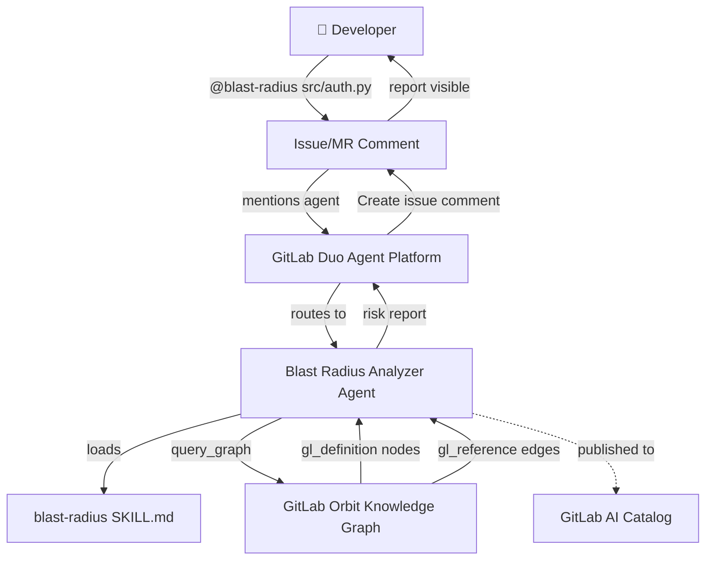
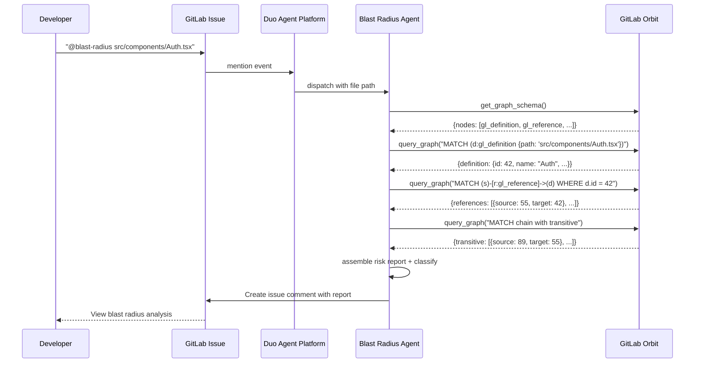

# Architecture

## System Overview

```
Developer mentions @blast-radius in issue comment
  ↓
GitLab Duo Agent Platform routes mention to agent
  ↓
Agent receives file path + project context from AGENTS.md + skill
  ↓
Agent calls Orbit MCP: get_graph_schema → query_graph
  ↓
Orbit traverses knowledge graph (definitions → references → transitive)
  ↓
Agent assembles dependency chain + risk classification
  ↓
Agent posts risk report as issue comment via Create Issue Comment tool
```

## Component Architecture



## Data Flow



## Knowledge Graph Schema

Orbit represents code as a graph:

### Node Types

| Label | Description |
|---|---|
| `gl_definition` | A code definition: file, function, class, module, interface |
| `gl_documentation` | Documentation associated with a definition |

### Edge Types

| Label | Description |
|---|---|
| `gl_reference` | Source file references/depends on target file |
| `gl_documents` | Documentation relationship |

### gl_definition Properties

| Property | Type | Description |
|---|---|---|
| `id` | int | Unique identifier |
| `name` | string | Human-readable name (function/class name) |
| `path` | string | File path within the repository |
| `language` | string | Programming language (python, typescript, etc.) |
| `project_path` | string | GitLab project path |

### gl_reference Properties

| Property | Type | Description |
|---|---|---|
| `source_id` | int | The file doing the importing/referencing |
| `target_id` | int | The file being imported/referenced |
| `relationship_type` | string | import, call, extend, implement |

## Blast Radius Traversal Algorithm

Corrected, cycle-safe BFS. `visited` is seeded with the target **and** every
node is added to `visited` as soon as it is discovered, before recursing, so a
node is never counted twice and cycles cannot loop forever (issue #8). The
reference implementation is `blast_radius/engine.py`, covered by
`tests/test_engine.py`.

```
function blast_radius(target_path, function_name=None, max_depth=3):
    # Exact-aware resolution; raise on zero matches, or on multiple files
    # when no function name was given to disambiguate (issue #7).
    targets = resolve_target(target_path, function_name)
    target_ids = {t.id for t in targets}

    visited = set(target_ids)        # seed with the target(s)
    direct, transitive = [], []

    # Level 1 — direct dependents (reverse gl_reference edges).
    frontier = set()
    for dep in dependents_of(target_ids):
        if dep.id in visited or excluded(dep.path):
            continue
        visited.add(dep.id)          # mark before recursing
        frontier.add(dep.id)
        direct.append(dep)

    # Levels 2..max_depth — transitive dependents.
    depth = 2
    while frontier and depth <= max_depth:
        next_frontier = set()
        for dep in dependents_of(frontier):
            if dep.id in visited or excluded(dep.path):
                continue
            visited.add(dep.id)
            next_frontier.add(dep.id)
            transitive.append((dep, depth))
        frontier = next_frontier
        depth += 1

    projects = distinct_project_paths(direct + [d for d, _ in transitive])
    return classify_risk(len(direct), len(transitive), len(projects))
```

> **Note on dialects (issue #2):** the sequence diagram above shows Cypher-style
> `query_graph` calls used in **Remote** mode. In **Local** mode the engine emits
> the SQL shown in the skill via `orbit sql`. See `docs/ORBIT_CONTRACT.md` for
> the full contract and which dialect applies where.

## Deployment

### GitLab AI Catalog

The agent is published to the GitLab AI Catalog as a public agent:
- Created via Project → AI → Agents → New Agent
- Visibility: Public (required for catalog publishing)
- Published to: [gitlab.com/explore/ai-catalog/agents/](https://gitlab.com/explore/ai-catalog/agents/)

### GitLab Duo Agent Platform Integration

- The agent is invoked through mentions in GitLab issues and MRs
- It has the "Create issue comment" tool enabled to post findings
- AGENTS.md provides project-level context loaded by the agent
- The blast-radius skill (SKILL.md) teaches the agent how to query Orbit

### Orbit Dependency

- **Remote**: GitLab.com group with Orbit Premium/Ultimate feature enabled
- **Local fallback**: Orbit CLI (`orbit index` + `orbit sql` queries)
- The agent detects available Orbit mode and adjusts queries accordingly
